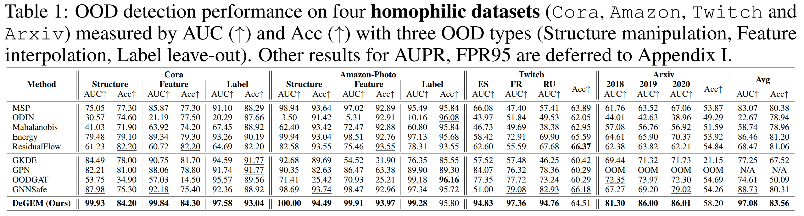
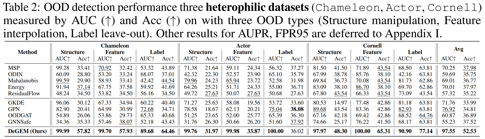

# DeGEM: Out-of-Distribution Node Detection by Graph Energy-based Model
Official implementation for ICLR'25 paper ''*Decoupled Graph Energy-based Model for Node Out-of-Distribution Detection on Heterophilic Graphs*''[[arxiv]](https://arxiv.org/abs/2502.17912),
by Yuhan Chen*, Yihong Luo*, Yifan Song, Pengwen Dai, Jing Tang,  Xiaochun Cao (* means equal contribution) 


## Abstract
Despite extensive research efforts focused on Out-of-Distribution (OOD) detection on images, OOD detection on nodes in graph learning remains underexplored. The dependence among graph nodes hinders the trivial adaptation of existing approaches on images that assume inputs to be i.i.d. sampled, since many unique features and challenges specific to graphs are not considered, such as the heterophily issue. Recently, GNNSafe, which considers node dependence, adapted energy-based detection to the graph domain with state-of-the-art performance, however, it has two serious issues: 1) it derives node energy from classification logits without specifically tailored training for modeling data distribution, making it less effective at recognizing OOD data; 2) it highly relies on energy propagation, which is based on homophily assumption and will cause significant performance degradation on heterophilic graphs, where the node tends to have dissimilar distribution with its neighbors. To address the above issues, we suggest training Energy-based Models (EBMs) by Maximum Likelihood Estimation (MLE) to enhance data distribution modeling and removing energy propagation to overcome the heterophily issues. However, training EBMs via MLE requires performing Markov Chain Monte Carlo (MCMC) sampling on both node feature and node neighbors, which is challenging due to the node interdependence and discrete graph topology. To tackle the sampling challenge, we introduce Decoupled Graph Energy-based Model (DeGEM), which decomposes the learning process into two parts—a graph encoder that leverages topology information for node representations and an energy head that operates in latent space. Additionally, we propose a Multi-Hop Graph encoder (MH) and Energy Readout (ERo) to enhance node representation learning, Conditional Energy (CE) for improved EBM training, and Recurrent Update for the graph encoder and energy head to promote each other. This approach avoids sampling adjacency matrices and removes the need for energy propagation to extract graph topology information. Extensive experiments validate that DeGEM, without OOD exposure during training, surpasses previous state-of-the-art methods, achieving an average AUROC improvement of 6.71% on homophilic graphs and 20.29% on heterophilic graphs, and even outperforming methods trained with OOD exposure.

## Evaluation Results




## Requirements
```
torch
torch-geometric
ogb
```

## Train Model
Run `main.py` to train with the default setting, and the datasets will be downloaded automatically into `./_data/`. 

You can also customize the settings in `config.py`. 

## Contact
Please contact Yuhan Chen (draym@qq.com or draym28@gmail.com) or Yihong Luo (yluocg@connect.ust.hk) if you have any question about this code. 
